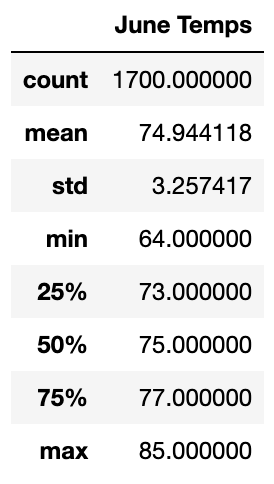
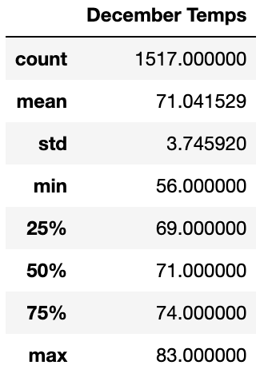

# Surfs Up Challenge

## Purpose
### The purpose of this challenge was to extropolate temperature data for the months of June and December in Oahu, in order to determine if the surf and ice cream shop business is sustainable year-round.

## Results
### In the images below, we can see that the average temperatures in June and December are within three degrees.  But a closer look at the data shows us that there are a few differences.

* The minimum temperature in December was 56 degrees vs. 64 degrees in June.
* The maximum temperature in December was 83 degrees vs. 85 degrees in June.
* The standard deviation in December was 3.745920 vs. 3.257417 in June

  

## Summary
### Based on the data from both months we are able to see that there is a minimal difference in temperature.   As a result of this data, it would be safe to assume that business would be sustainable all year-round.
